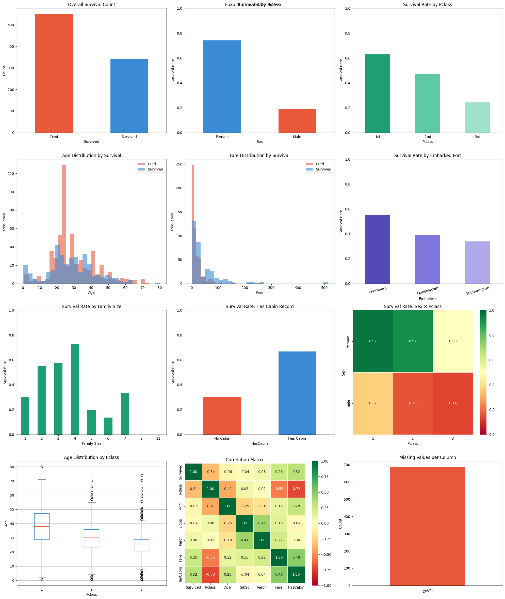
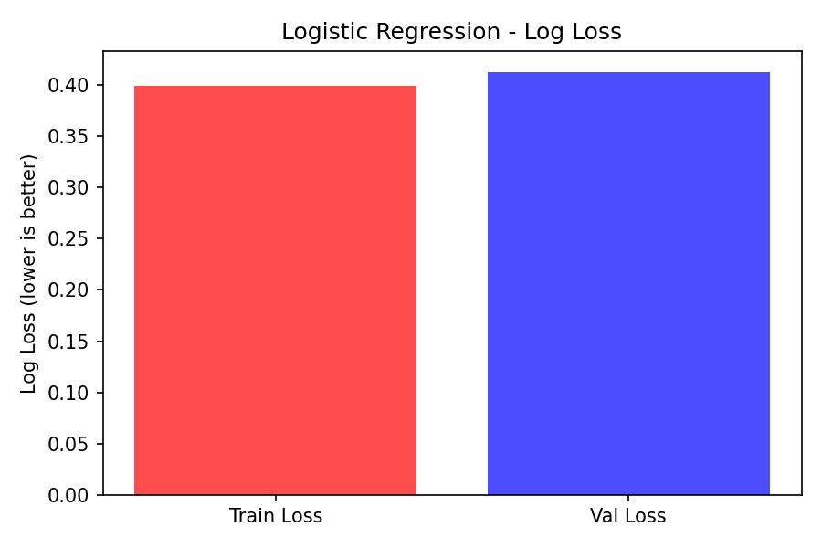
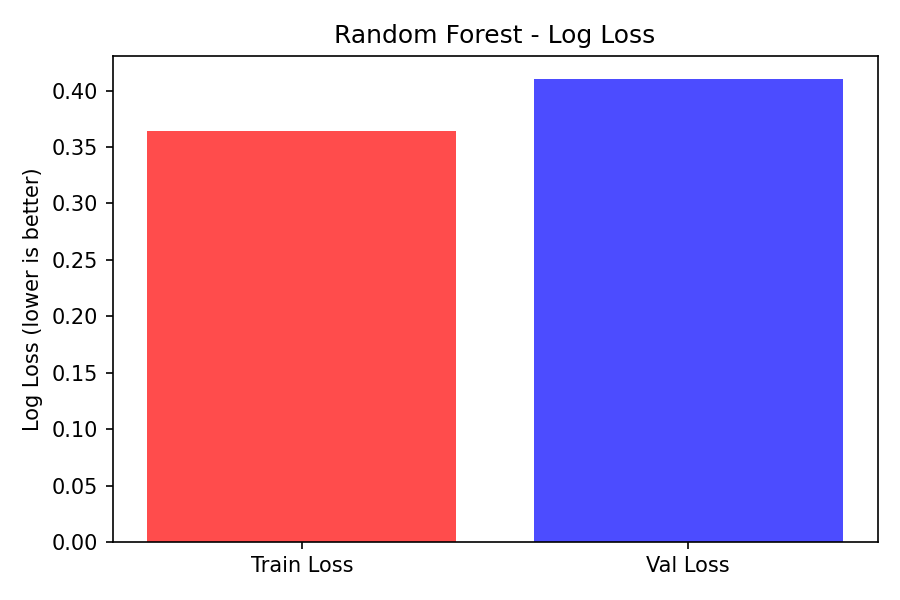
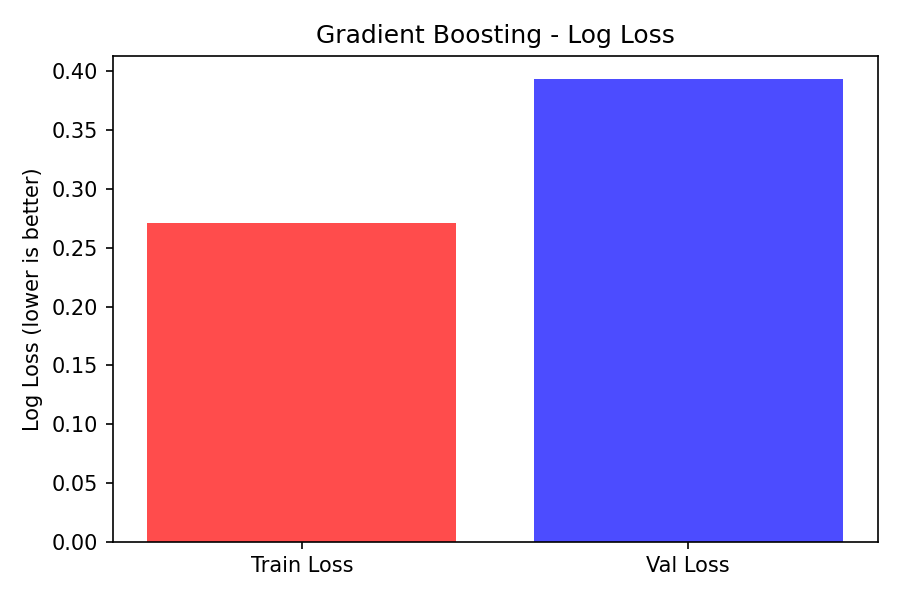
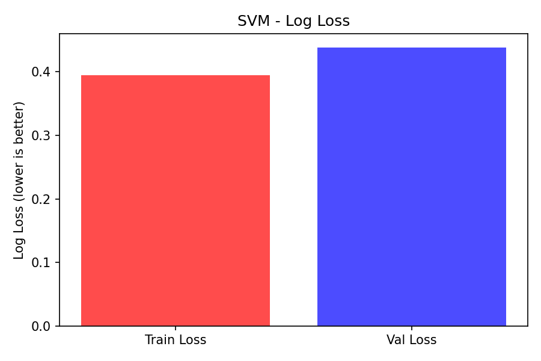
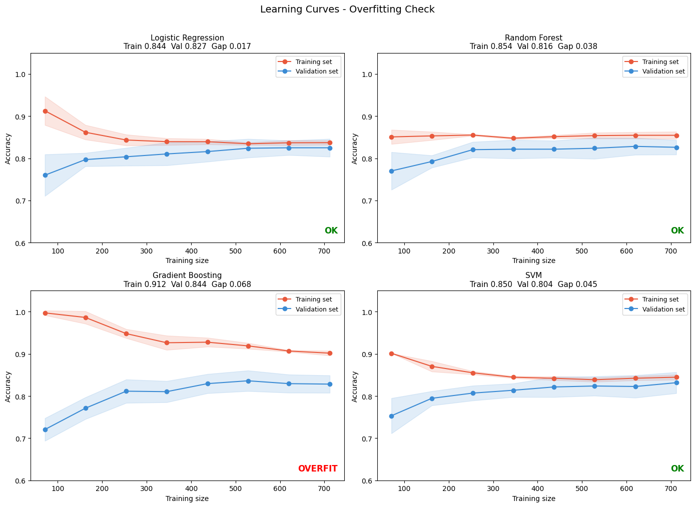

# Titanic - Machine Learning from Disaster

## Project Overview
This project tackles the classic Kaggle Titanic challenge: 
predicting passenger survival using machine learning. 
The goal is to build a classification model that determines 
whether a passenger survived based on features such as age, 
sex, ticket class, and family size.

**Kaggle Public Score: 0.78708**

---

## Dataset
- **Source**: [Kaggle Titanic Competition](https://www.kaggle.com/c/titanic)
- **Training set**: 891 passengers with survival labels
- **Test set**: 418 passengers (labels hidden)
- **Target variable**: `Survived` (0 = No, 1 = Yes)

---

## 1. Data Cleaning
Handled missing values across three columns:

| Column | Missing Count | Strategy |
|--------|--------------|----------|
| Age | 177 | Median grouped by Sex + Pclass |
| Embarked | 2 | Mode fill |
| Cabin | 687 | Converted to binary flag `HasCabin` |

Grouping Age by Sex and Pclass ensures that missing ages 
are filled with contextually appropriate values rather 
than a single global mean.

---

## 2. Feature Engineering
New features created to improve predictive power:

| Feature | Description |
|---------|-------------|
| `Title` | Extracted from passenger name (Mr, Mrs, Miss, Master, Rare) |
| `FamilySize` | SibSp + Parch + 1 |
| `IsAlone` | 1 if FamilySize == 1 |
| `AgeBand` | Age binned into Child / Teen / Adult / Middle / Senior |
| `FareBand` | Fare quartile bins (0-3) |
| `HasCabin` | Binary flag for cabin information availability |

Correlation between each feature and survival rate was 
visualised through diagrams prior to feature selection, 
providing data-driven justification for the engineering decisions.

---

## 3. Model Training & Cross Validation
Four classifiers were trained and evaluated using 
**5-Fold Stratified Cross Validation** to ensure robust 
performance estimates and reduce overfitting risk.

| Model | CV Accuracy | Std |
|-------|-------------|-----|
| Logistic Regression | 0.8249 | 0.0212 |
| Random Forest | 0.8260 | 0.0172 |
| Gradient Boosting | 0.8271 | 0.0279 |
| **SVM** | **0.8316** | **0.0250** |

**Best model: SVM (C=1.0, kernel=rbf)**

---

## 4. Model Evaluation

### Loss (Log Loss)
Log loss was used as a supplementary evaluation metric 
to assess prediction confidence beyond simple accuracy. 
It penalises uncertain or wrong predictions more heavily, 
providing a more nuanced view of model performance.

| Model | Train Loss | Val Loss |
|-------|-----------|---------|
| Logistic Regression | - | - |
| Random Forest | - | - |
| Gradient Boosting | - | - |
| SVM | 0.3943 | 0.4380 |

### Learning Curves (Accuracy)
Training vs validation accuracy curves were plotted for 
all four models to diagnose overfitting and underfitting.

> Gradient Boosting showed signs of overfitting with a 
> train/validation accuracy gap of 0.068. All other models 
> showed healthy convergence between training and validation scores.

---

## 5. Results

| | Score |
|---|---|
| Best CV Accuracy (local) | 0.8316 |
| Kaggle Public Score | 0.78708 |

The gap between local CV score and Kaggle public score 
reflects mild overfitting to the training distribution, 
which is expected given the small dataset size (~891 samples).

---

## Tech Stack
- Python 3
- pandas, numpy
- scikit-learn
- matplotlib, seaborn
- Jupyter Notebook
